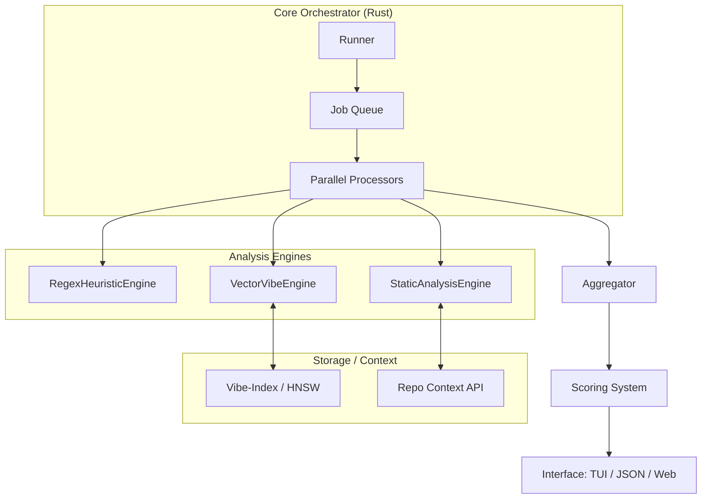

# Vibe-Check Architecture

`vibe-check` is built as a high-performance **Rust-powered Orchestrator** that coordinates a modular "Service-Bus" of analysis engines.

## System Overview

## Core Components

### 1. Vector Vibe Engine (VE)
The VE is the brain of the consistency check. It doesn't look at syntax; it looks at **intent**.
- **The Baseline**: `vibe-check index` crawls your "Golden Files" (core architecture, proven services) and compresses them into a local **HNSW (Hierarchical Navigable Small World)** vector index.
- **The Check**: When new code is scanned, the VE generates a high-dimensional embedding and measures the **Cosine Similarity** against the baseline. If a "Service" feels more like a "Controller", the vibe score drops.

### 2. Regex Heuristic Engine (RE)
The "Slop Hunter" front-line. It uses optimized Rust regex sets to catch conversational residue.
- **Tier 1**: Model "throat-clearing" patterns.
- **Tier 2**: "The Hedge" detection (over-softening).
- **Tier 3**: Redundant docstring restatements.

### 3. Static Analysis Engine (AE)
Built on `tree-sitter`, this engine analyzes structural health:
- Function fragmentation (single-use helpers).
- Dependency health (unused exports via `GhostCode`).
- Variable naming semantic density.

---

## The Vibe Score Calculation

The final output is a weighted average:
- **Consistency** (30%): Vector baseline similarity.
- **Hygiene** (40%): Absence of slop patterns.
- **Structure** (30%): Code metrics and connectivity.
