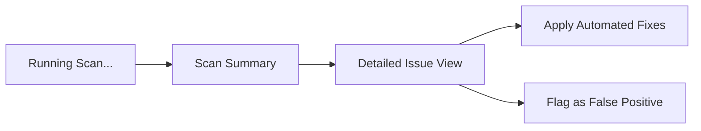

# Interface Design & Visuals

`vibe-check` follows the **ItamiForge High-Aesthetic Standard**: deep purples, functional glassmorphism, and high-density technical data.

## 1. Branding & Identity

The logo represents a scanning beam passing through a glass code block, signifying the tool's deep-inspection capabilities.

---

## 2. High-Fidelity Dashboard Concept

The web dashboard is organized into a **Bento Grid** for maximum scannability.

### Widget Design Rationale
- **Hygiene Score**: A primary KPI showing overall codebase health.
- **Directory Heatmap**: Visualizes "Slop Hotspots" across the repo. Red zones indicate high "Model Fingerprint" density.
- **Slop Log**: Real-time list of conversational fragments and stale patterns found in the last scan.
- **Vibe Trend**: Tracks if the codebase is getting "cleaner" or "sloppier" over the development lifecycle.

---

## 3. TUI / Developer Flow

In the terminal, `vibe-check` uses `ratatui` to provide a similar rich experience:

### Key TUI Features:
- **Scan Glitch FX**: Subtle visual feedback during scanning.
- **Keyboard Shortcuts**: One-key "Nuke Slop" functionality.
- **Diff View**: Instant preview of suggested comment/code cleanups.
